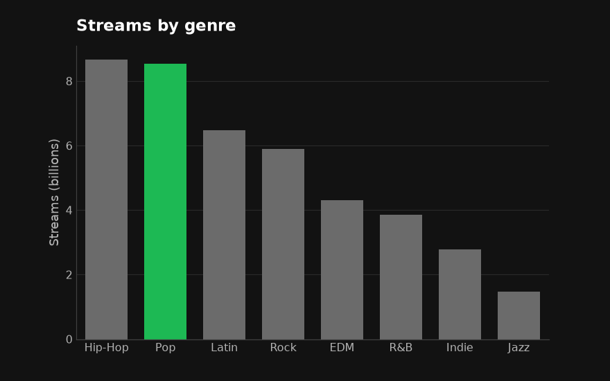
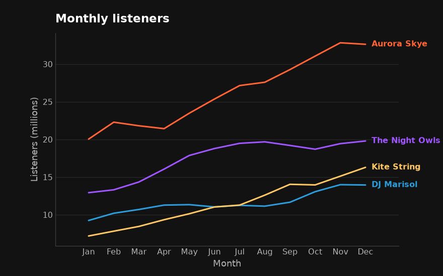
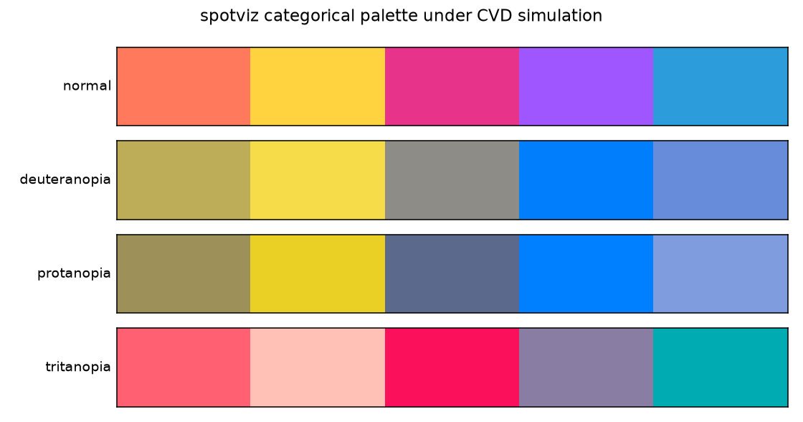

# spotviz

**Clean, on-brand matplotlib charts from pandas — a bold dark theme, by default.**

`spotviz` is a thin wrapper over [pandas](https://pandas.pydata.org/) and
[matplotlib](https://matplotlib.org/). Call one simple function on your
DataFrame and get a chart with a bold, modern dark look — a dark
`#121212` ground, a signature green (`#1DB954`) as the single accent, decluttered and
honest — without configuring anything. Every helper auto-labels from your
DataFrame and returns the matplotlib `Axes` so you can keep customizing.

Its only dependencies are **pandas** and **matplotlib**.

> An independent, educational project (USF MSDS610). Its dark theme and green
> accent are inspired by the look of modern music-streaming apps; it is not
> affiliated with or endorsed by any company.

## Why these defaults

The defaults encode what data-viz research finds most impactful — viewers judge
a chart in ~500ms mostly on **color** and **visual complexity** — so the effort
order is **color → declutter → typography → helpers**:

- **Bold dark identity by default** — `#121212` ground, white/gray text,
  the signature green (`#1DB954`) as the *one* accent against muted grays.
- **Green means emphasis.** Single-series charts rest in green; add
  `highlight=` and the rest go gray so green marks the thing that matters.
  Multi-series charts use a separate **colorblind-checked categorical palette**
  — and green is deliberately kept out of it so it never loses its meaning.
- **Decluttered** — no top/right spines, no bounding box, subtle low-contrast
  gridlines behind the data, thin ticks.
- **Honest** — bars start at zero; marker size scales by **area**, not radius;
  no 3D, no rainbow maps, no distorted aspect ratios.
- **Two modes** — analytical (default) and a `presentation=True` report mode
  (larger type, 16:9, value labels) — plus a `theme="light"` variant for print.

## Installation

```bash
pip install spotviz
```

Or from source:

```bash
git clone https://github.com/ahzengyang/msds610_viz.git
cd msds610_viz
pip install -e .
```

## Usage

```python
import pandas as pd
import spotviz as sv

genres = pd.read_csv("data/genre_streams.csv")

# Bar: highlight one category in green, mute the rest.
ax = sv.bar(genres, x="genre", y="streams", sort="desc", highlight="Pop",
            title="Streams by genre")

# Line: multiple series use the categorical palette and label directly.
listeners = pd.read_csv("data/monthly_listeners.csv")
ax = sv.line(listeners, x="month", title="Monthly listeners (millions)")

# Scatter: size scales by area; color by a continuous feature (viridis).
tracks = pd.read_csv("data/tracks.csv")
ax = sv.scatter(tracks, x="energy", y="danceability",
                size="popularity", color="popularity")

# Every helper returns a normal matplotlib Axes.
sv.savefig(ax.figure, "chart.png")   # saves preserving the dark background
```

### The default (dark) look




### Modes and variants

One argument switches mode or theme — the color identity and honesty rules stay
the same:

```python
sv.bar(genres, x="genre", y="streams", presentation=True)   # report/slide mode
sv.bar(genres, x="genre", y="streams", theme="light")       # light print variant
```

| | Analytical (default) | Presentation (`presentation=True`) |
| --- | --- | --- |
| **Dark** (default) | everyday data viz | slides / reports (larger, 16:9) |
| **Light** (`theme="light"`) | print / journal | light slides |

### Theming your own matplotlib code

The theme is also available for plain matplotlib, as a named style, a scoped
context, or a global opt-in:

```python
import matplotlib.pyplot as plt
import spotviz as sv                     # importing registers the styles

plt.style.use("spotviz-dark")            # or spotviz-light / *-report
with sv.theme_context("dark"):
    ...
sv.apply_theme("dark")                   # global; reversible via plt.rcdefaults()
```

## API (MVP)

| Function | Purpose |
| --- | --- |
| `bar(data, x=None, y=None, *, theme="dark", presentation=False, highlight=None, sort=None, orient="vertical", ...)` | Single-series bar chart; green resting / green accent on `highlight`. |
| `line(data, x=None, y=None, *, highlight=None, direct_label=True, ...)` | Multi-series line chart; categorical palette + direct labels. |
| `scatter(data, x, y, *, size=None, color=None, ...)` | Scatter; area-scaled sizes, viridis for continuous color. |
| `apply_theme(theme="dark", presentation=False)` | Apply the theme to global rcParams. |
| `theme_context(theme="dark", presentation=False)` | Context manager applying the theme temporarily. |
| `plt.style.use("spotviz-dark" \| "spotviz-light" \| ...)` | Named styles (registered on import). |
| `savefig(fig, path)` | Save preserving the themed background. |

## Accessibility

The categorical palette is verified with a colorblindness simulation
(`tools/check_cvd.py`): Machado (2009) matrices for deuteranopia / protanopia /
tritanopia, then CIELAB ΔE between every pair. The shipped palette keeps a
minimum pairwise ΔE of ≈ 21 under all three — no two categories collapse
together — and the dark theme's text/accent/muted grays clear WCAG contrast on
`#121212`. Categories are also paired with direct labels, never distinguished
by hue alone.



## Project layout

```
msds610_viz/
├── src/spotviz/
│   ├── __init__.py       # public API
│   ├── palette.py        # brand colors + categorical palette
│   ├── theme.py          # rcParams themes + named styles
│   ├── _core.py          # shared theming/finalize helpers
│   ├── bar.py
│   ├── line.py
│   └── scatter.py
├── data/
│   ├── generate_data.py  # reproducible sample data (pandas + stdlib)
│   ├── genre_streams.csv
│   ├── monthly_listeners.csv
│   └── tracks.csv
├── examples/
│   └── demo.py
├── tests/
│   └── test_spotviz.py
├── tools/
│   └── check_cvd.py      # colorblindness / WCAG validation (dev tool)
├── pyproject.toml
├── LICENSE
└── README.md
```

## Development

```bash
pip install -e .
python data/generate_data.py     # regenerate sample data
python examples/demo.py          # render the example charts
python -m pytest                 # or: python tests/test_spotviz.py
```

## License

MIT
