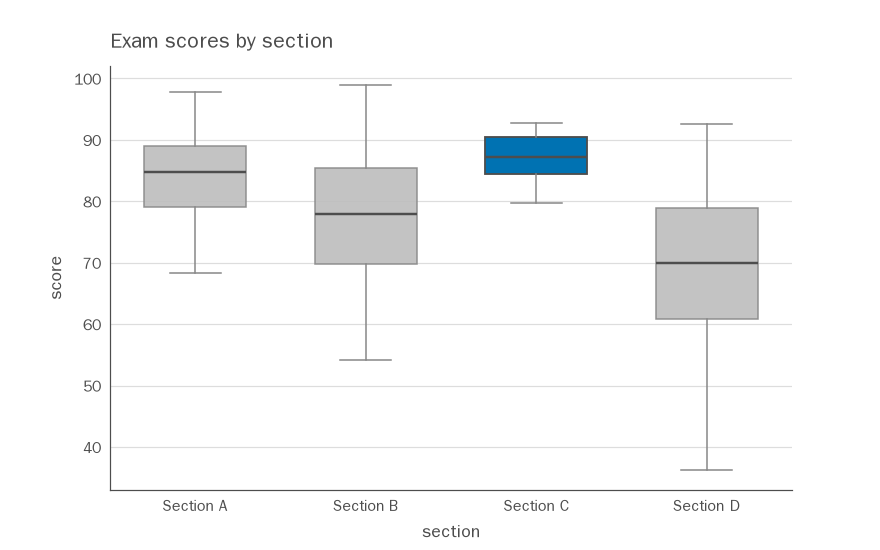

# cleanplot

**Clean, honest matplotlib charts from pandas — by default.**

`cleanplot` is a thin wrapper over [pandas](https://pandas.pydata.org/) and
[matplotlib](https://matplotlib.org/). Call one simple function on your
DataFrame and get a chart that's noticeably more readable than raw matplotlib —
without configuring anything. It ships a clean default theme, a colorblind-safe
palette, and self-labeling chart helpers, and it always hands you back the
matplotlib `Axes` so you can keep customizing.

Its only dependencies are **pandas** and **matplotlib**.

## Why

Raw matplotlib defaults are cluttered: boxy spines on all four sides, heavy
gridlines, cramped labels, and a color cycle that isn't colorblind-safe.
`cleanplot`'s defaults follow a few principles so that *whatever* you plot comes
out clear and honest:

- **Maximize data-ink** — drop top/right spines, lighten gridlines, thin the
  ticks, give type room to breathe.
- **Encode for perception** — favor position/length; use one accent color
  against muted grays instead of a rainbow.
- **Colorblind-safe by default** — the categorical palette is the Okabe-Ito set.
- **Reads Chinese (and other non-Latin) text** — the theme ships a CJK-capable
  font fallback and disables the broken minus glyph, so labels render instead of
  blank "tofu" boxes.
- **Honest by default** — sensible axes; nothing gimmicky like gratuitous 3D.
- **Composable** — helpers accept an optional `ax=` and return the `Axes`; the
  theme is applied in a scoped context, not by silently mutating global state.

## Installation

From source (this repo):

```bash
git clone https://github.com/ahzengyang/msds610_viz.git
cd msds610_viz
pip install -e .
```

This installs `cleanplot` along with its dependencies (pandas, matplotlib).

> Eventually this will be published to PyPI as `pip install cleanplot`.

## Usage

### Box plot from a "long" DataFrame

One box per group, axes labeled automatically from the column names, one group
highlighted with an accent color:

```python
import pandas as pd
import cleanplot as cp

df = pd.read_csv("data/section_scores.csv")   # columns: section, score

ax = cp.boxplot(
    df,
    column="score",       # the value column
    by="section",         # one box per distinct value here
    highlight="Section C",  # accent this box; mute the rest
    title="Exam scores by section",
)

ax.figure.savefig("boxplot_sections.png")   # ax is a normal matplotlib Axes
```



### Box plot from a "wide" DataFrame

Pass a DataFrame with one numeric column per box — no extra arguments needed:

```python
import pandas as pd
import cleanplot as cp

df = pd.DataFrame({"control": [...], "treatment": [...]})
ax = cp.boxplot(df)          # one box per column, labeled by column name
```

### Chinese / non-Latin labels

No extra setup — Chinese column names, titles, and categories just render:

```python
import pandas as pd
import cleanplot as cp

df = pd.DataFrame({"班级": [...], "考试成绩": [...]})
ax = cp.boxplot(df, column="考试成绩", by="班级", title="各班级考试成绩分布")
```

The theme lists common CJK fonts across macOS / Windows / Linux (PingFang SC,
Microsoft YaHei, WenQuanYi Zen Hei, Noto Sans CJK, …) and uses the first one
installed, so this works out of the box on a typical system.

### Applying the theme to your own matplotlib code

The theme isn't only for cleanplot's helpers. Use it three ways:

```python
import matplotlib.pyplot as plt
import cleanplot as cp   # importing registers the "cleanplot" style

# 1) The plain-matplotlib way — apply the named style.
plt.style.use("cleanplot")

# 2) Scoped: only this block is themed.
with cp.style_context():
    fig, ax = plt.subplots()
    ax.plot([0, 1, 2], [0, 1, 4])

# 3) Globally for a whole script (reversible via matplotlib.rcdefaults()).
cp.apply_style()
```

The theme itself is a plain matplotlib style sheet
(`src/cleanplot/cleanplot.mplstyle`), so it's easy to read and tweak.

## API (MVP)

| Function | Purpose |
| --- | --- |
| `boxplot(data, column=None, by=None, *, ax=None, orient=..., highlight=..., ...)` | Self-labeling box plot from a DataFrame/Series; returns `Axes`. |
| `plt.style.use("cleanplot")` | Apply the theme the plain-matplotlib way (registered on import). |
| `apply_style(overrides=None)` | Apply the cleanplot theme to global matplotlib rcParams. |
| `style_context(overrides=None)` | Context manager applying the theme temporarily. |
| `STYLE_PATH` | Path to the shipped `cleanplot.mplstyle` style sheet. |
| `categorical(n=None)` | The colorblind-safe categorical palette (cycled to `n`). |
| `RC_PARAMS` | The theme as a plain rcParams dict, for inspection/tweaking. |

## Project layout

```
msds610_viz/
├── src/cleanplot/        # the library
│   ├── __init__.py       # public API
│   ├── cleanplot.mplstyle # the theme as a matplotlib style sheet (source of truth)
│   ├── theme.py          # loads + registers the theme; style helpers
│   ├── palette.py        # colorblind-safe palette
│   └── boxplot.py        # the boxplot helper
├── data/
│   ├── generate_data.py  # reproducible sample-data generator (pandas + stdlib)
│   └── section_scores.csv
├── examples/
│   └── boxplot_example.py
├── tests/
│   └── test_boxplot.py
├── pyproject.toml
└── README.md
```

## Development

```bash
pip install -e .
python data/generate_data.py      # regenerate the sample dataset
python examples/boxplot_example.py
python -m pytest                  # or: python tests/test_boxplot.py
```

## Status

Early MVP. The box plot is the first polished helper; bar/line/scatter are the
planned next additions. The API and defaults may still change.

## License

MIT
