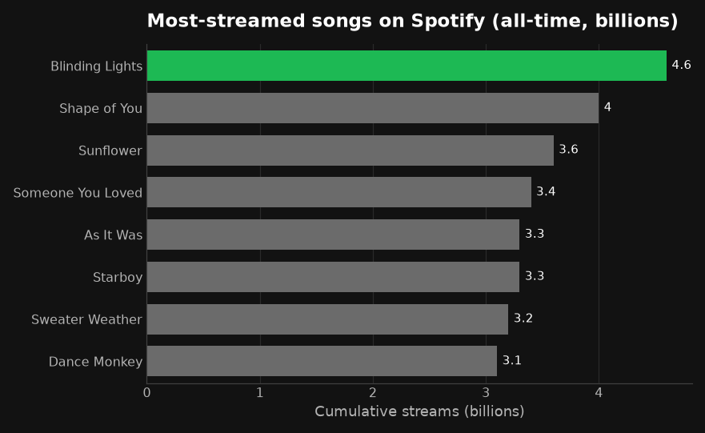
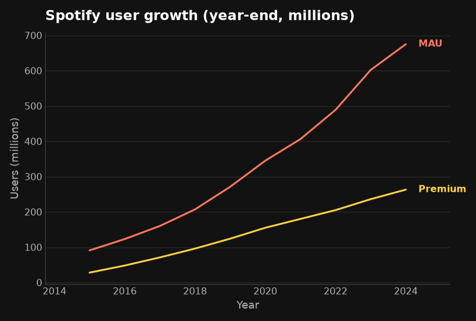

# spotviz

**Clean, on-brand matplotlib charts from pandas — a bold dark theme, by default.**

`spotviz` is a thin wrapper over [pandas](https://pandas.pydata.org/) and
[matplotlib](https://matplotlib.org/). Call one function on your DataFrame and
get a decluttered, honest chart with a dark `#121212` background and a single
green accent — no configuration. Every helper auto-labels from your DataFrame
and returns the matplotlib `Axes`, so you can keep customizing.

Its only dependencies are **pandas** and **matplotlib**.

## Installation

```bash
pip install spotviz
```

## Usage

```python
import pandas as pd
import spotviz as sv

df = pd.read_csv("data.csv")

ax = sv.bar(df, x="category", y="value")   # bar chart
sv.line(df, x="date")                       # line chart (one series per column)
sv.scatter(df, x="a", y="b")                # scatter

sv.savefig(ax.figure, "chart.png")          # save, preserving the dark background
```

Switch mode or theme with one argument — `presentation=True` for slides,
`theme="light"` for print:

```python
sv.bar(df, x="category", y="value", presentation=True)
sv.bar(df, x="category", y="value", theme="light")
```

## Examples

**Bar — highlight one category in green, mute the rest:**

```python
tracks = pd.read_csv("data/top_streamed_tracks.csv")
sv.bar(tracks, x="track", y="streams_billions",
       sort="desc", highlight="Blinding Lights", orient="horizontal",
       label_values=True, title="Most-streamed songs (billions)")
```



**Line — multiple series with direct labels instead of a legend:**

```python
growth = pd.read_csv("data/spotify_user_growth.csv")
sv.line(growth, x="year", title="User growth (millions)")
```



## License

MIT
